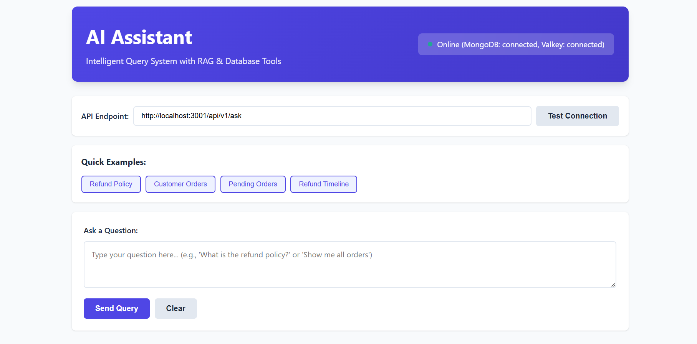

# AI Assistant Backend

A production-quality AI-powered backend service built with TypeScript, Node.js, and Koa that demonstrates **OpenAI SDK** function calling to intelligently route between two tools:

- **RAG Tool**: Retrieval-Augmented Generation using Pinecone vector search
- **Database Tool**: MongoDB queries via Mongoose for structured order data

## Features

- OpenAI function calling for intelligent tool selection
- Vector search with Pinecone for document retrieval
- MongoDB integration for structured data queries
- Clean SOLID architecture with clear separation of concerns
- Comprehensive logging with Pino
- Valkey (Redis) distributed caching with singleton pattern
*   Input validation with Zod
*   **Robust Startup Validation:** Ensures all critical services (MongoDB, Valkey, Pinecone, OpenAI) are correctly initialized and connected before the application starts.
- TypeScript with strict mode
- ESLint + Prettier for code quality
- Docker Compose for local development

## Architecture

```
ai-assistant-backend/
├── src/
│   ├── app.ts                      # Koa app setup
│   ├── server.ts                   # Server initialization
│   ├── index.ts                    # Entry point
│   ├── routes/
│   │   └── ask.route.ts            # API routes
│   ├── controllers/
│   │   └── ask.controller.ts       # Request handlers
│   ├── services/
│   │   ├── orchestrator.service.ts # Function calling logic
│   │   ├── rag.service.ts          # Pinecone RAG implementation
│   │   └── db.service.ts           # MongoDB queries
│   ├── infra/
│   │   ├── openai.client.ts        # OpenAI SDK wrapper
│   │   ├── pinecone.client.ts        # Pinecone SDK wrapper
│   │   ├── mongo.client.ts         # MongoDB connection
│   │   ├── valkey.client.ts        # Valkey (Redis) singleton client
│   │   └── logger.ts               # Pino logger
│   ├── domain/
│   │   ├── order.model.ts          # Mongoose schema
│   │   └── types.ts                # TypeScript types
│   ├── utils/
│   │   ├── time.ts                 # Date parsing utilities
│   │   └── cache.ts                # Valkey cache implementation
│   └── config/
│       └── env.ts                  # Environment validation
├── scripts/
│   ├── seed.ts                     # Seed MongoDB with sample data
│   └── index-doc.ts                # Index documents to Pinecone
├── docker/
│   └── docker-compose.yml          # MongoDB & Valkey containers
├── test/
│   └── ask.e2e.test.ts             # E2E tests
└── README.md
```

## Design Patterns & SOLID Principles

This project is built with a strong emphasis on clean architecture, leveraging established design patterns and adhering to SOLID principles to ensure maintainability, scalability, and extensibility. The `orchestrator.service.ts` serves as a prime example of these practices in action.

### Design Patterns

*   **Singleton Pattern**: The `aiAgent` is instantiated using a lazy-loading `getAgent()` function. This ensures that the `Agent` instance is created only once upon its first request and then reused throughout the application's lifecycle. This approach conserves resources by avoiding redundant object creation and guarantees a single, consistent point of control for the AI agent's configuration and state.
    *   **Example**: The `getAgent()` function in `src/services/orchestrator.service.ts`
*   **Strategy Pattern (Implicit)**: The `Orchestrator` service, while not explicitly defining a Strategy interface, effectively acts as a context for the Strategy pattern. The OpenAI `Agent` is configured with a collection of `tools` (`retrieveDocumentContextTool`, `queryDatabaseTool`). Based on the user's query and the agent's internal instructions, the `Agent` dynamically selects and executes the most appropriate tool (strategy). This allows for flexible and extensible tool selection without modifying the core orchestration logic.
    *   **Example**: The `tools` array passed to the `Agent` constructor in `src/services/orchestrator.service.ts`
*   **Wrapper/Adapter Pattern**: Both the OpenAI `Agent` and the individual `tools` (e.g., `retrieveDocumentContextTool`, `queryDatabaseTool`) exemplify the Wrapper/Adapter pattern. The `Agent` wraps the complexities of the underlying OpenAI API interactions, providing a simplified and structured interface for defining AI behavior. Similarly, the tools adapt specific functionalities (like Pinecone RAG or MongoDB queries) to conform to the `Agent`'s expected tool interface, promoting interoperability.
    *   **Example**: `Agent` instantiation and `tools` usage in `src/services/orchestrator.service.ts`, and the structure of tool definitions in `src/tools/agent-tools.ts`.

### SOLID Principles

*   **Single Responsibility Principle (SRP)**: The project's modular structure strongly adheres to SRP. For instance, `orchestrator.service.ts` is solely responsible for managing the AI agent's execution flow, caching, and tracing. It delegates specific concerns like data retrieval (RAG) or database operations to dedicated services and tools, ensuring each module has one clear reason to change.
    *   **Example**: `orchestrator.service.ts` delegates RAG to `rag.service.ts` and database queries to `db.service.ts`.
*   **Dependency Inversion Principle (DIP)**: The `Orchestrator` service depends on abstractions rather than concrete implementations. It interacts with the OpenAI `Agent` through its defined interface and relies on an array of `tools` (abstractions of specific functionalities). Furthermore, it imports `logger` from `src/infra/logger.ts` and `env` from `src/config/env.ts`, treating them as abstract interfaces for logging and configuration, respectively. This reduces coupling and increases flexibility.
    *   **Example**: Imports of `logger` and `env`, and the configuration of `tools` in `src/services/orchestrator.service.ts`.

## Clean Code Practices

The codebase prioritizes readability, maintainability, and robustness through consistent application of clean code principles. The `orchestrator.service.ts` provides a clear illustration of these practices:

*   **Meaningful Names**: Variables, functions, and classes are named descriptively, clearly conveying their purpose and intent (e.g., `userQuery`, `askOrchestrator`, `retrieveDocumentContextTool`, `agentResponseCache`). This significantly enhances code comprehension.
*   **Clear Structure and Modularity**: Functions are kept concise and focused on a single task. The code is organized into logical modules (e.g., `services`, `infra`, `domain`, `utils`), with clear separation of concerns. Imports from specialized modules ensure that each file has a well-defined role.
    *   **Example**: The `askOrchestrator` function's logical blocks for caching, agent execution, and error handling.
*   **Comprehensive Structured Logging**: The project utilizes `pino` for structured logging, capturing detailed context (e.g., `query`, `cacheHit`, `totalTime`, `error` objects) at various levels (`info`, `warn`, `error`). This provides excellent observability, making debugging and monitoring in production environments much more efficient.
    *   **Example**: `logger.info({ query: userQuery }, 'Starting orchestration with OpenAI Agent');`
*   **Robust Error Handling**: Critical operations are wrapped in `try-catch` blocks to gracefully manage exceptions. Errors are logged with detailed stack traces, and user-friendly messages are returned, preventing application crashes and aiding in quick issue identification.
    *   **Example**: The `try-catch` block within `askOrchestrator`.
*   **Type Safety**: Leveraging TypeScript with strict mode and explicit type definitions (e.g., `OrchestratorResult`, `ToolTrace`) ensures type safety throughout the application. This reduces runtime errors, improves code quality, and facilitates easier refactoring.
    *   **Example**: Type annotations for function parameters and return values in `orchestrator.service.ts`.
*   **Early Exit/Guard Clauses**: Functions often employ early exit conditions (e.g., returning cached responses immediately) to simplify control flow and improve readability by reducing nested logic.
    *   **Example**: The caching logic in `askOrchestrator` that returns early if a cached answer is found.

## Prerequisites

- Node.js >= 18.0.0
- pnpm (or npm/yarn)
- Docker and Docker Compose (for MongoDB and Valkey)
- OpenAI API key
- Pinecone account and API key
- MongoDB (via Docker or local installation)
- Valkey/Redis (via Docker or local installation)

## Setup Instructions

### 1. Clone the Repository

```bash
git clone <repository-url>
cd ai-assistant-backend
```

### 2. Install Dependencies

```bash
pnpm install
```

### 3. Configure Environment Variables

Create a `.env` file in the root directory:

```bash
cp .env.example .env
```

Edit `.env` with your credentials:

```env
# Server Configuration
HOST_API_PORT=3001
NODE_ENV=development

# OpenAI Configuration
OPENAI_API_KEY=sk-proj-xxxxxxxxxxxxxxxxxxxxx
OPENAI_MODEL=gpt-4o-mini

# Pinecone Configuration
PINECONE_API_KEY=xxxxxxxx-xxxx-xxxx-xxxx-xxxxxxxxxxxx
PINECONE_INDEX=ai-assistant-docs

# MongoDB Configuration
MONGODB_URI=mongodb://localhost:27017/ai-assistant

# Valkey (Redis) Configuration
VALKEY_HOST=localhost
VALKEY_PORT=6379
VALKEY_PASSWORD=
VALKEY_DB=0
VALKEY_TTL=3600
```

### 4. Set Up Pinecone

1. Create a free account at [Pinecone](https://www.pinecone.io/)
2. Create a new index:
   - Name: `ai-assistant-docs`
   - Dimensions: `1536` (for text-embedding-3-small)
   - Metric: `cosine`
3. Copy your API key to `.env`

### 5. Start MongoDB and Valkey

Using Docker Compose:

```bash
cd docker
docker-compose up -d
cd ..
```

This will start both MongoDB and Valkey containers.

Verify containers are running:

```bash
docker ps
```

You should see `ai-assistant-mongo` and `ai-assistant-valkey` running.

Or use your local MongoDB and Valkey/Redis installations.

### 6. Seed MongoDB with Sample Data

```bash
pnpm seed
```

This creates 10 sample orders in the database.

### 7. Index Sample Document to Pinecone

```bash
pnpm index-doc
```

This indexes a sample refund policy document to Pinecone.

### 8. Run the Development Server

```bash
pnpm dev
```

The server will start at `http://localhost:3001`

## API Usage

### Endpoint: POST /api/v1/ask

Send natural language queries to the AI assistant.

**Request:**

```bash
POST http://localhost:3001/api/v1/ask
Content-Type: application/json

{
  "query": "Your question here"
}
```

**Response:**

```json
{
  "query": "Your question here",
  "answer": "AI-generated answer",
  "trace": [
    {
      "toolName": "retrieveDocumentContext" | "queryDatabase",
      "arguments": { ... },
      "result": "Preview of tool result",
      "executionTime": 1234
    }
  ]
}
```

## Example Queries

### Example 1: RAG Tool (Document Retrieval)

**Query about refund policy:**

```bash
curl -X POST http://localhost:3001/api/v1/ask \
  -H "Content-Type: application/json" \
  -d '{"query": "What is the refund policy for defective products?"}'
```

## Further Enhancements and Best Practices

To further elevate this project and demonstrate advanced AI engineering capabilities, consider the following enhancements and best practices:

### 1. API Versioning

*   **Strategy**: Implement API versioning (e.g., `/api/v1/ask`, `/api/v2/ask`) to allow for backward compatibility and graceful evolution of the API. This ensures that existing clients are not broken when new features or changes are introduced.
*   **Implementation**: Use routing mechanisms to direct requests to specific API versions. This can be achieved through URL path versioning, query parameter versioning, or header versioning.

### 2. Enhanced Security Measures

*   **Authentication & Authorization**: Implement robust authentication and authorization mechanisms.
    *   **JWT (JSON Web Tokens)**: For securing API endpoints, allowing stateless authentication and efficient verification of user identity and permissions.
    *   **OAuth2**: For third-party integrations, enabling secure delegated access.
    *   **API Gateway**: Consider using an API Gateway for centralized security policies, rate limiting, and access control.
*   **Input Validation**: Reinforce input validation (already using Zod) at all API entry points to prevent injection attacks and ensure data integrity.
*   **Rate Limiting**: Implement rate limiting to protect against abuse and denial-of-service attacks.
*   **HTTPS**: Ensure all communication is encrypted using HTTPS (already supported by ngrok in development, but crucial for production).
*   **Secrets Management**: Securely manage API keys and other sensitive information using environment variables and dedicated secrets management services in production environments.

### 3. Scalability and High Availability

*   **Load Balancing**: Deploy multiple instances of the application behind a Load Balancer (e.g., Nginx, AWS ELB, GCP Load Balancing) to distribute incoming traffic, ensuring high availability and fault tolerance.
*   **Horizontal Scaling**: Design the application for horizontal scaling, allowing new instances to be added or removed based on demand.
*   **Auto-scaling**: Implement auto-scaling policies based on metrics like CPU utilization, memory usage, or request queue length to automatically adjust the number of running instances.
*   **Statelessness**: Ensure the application remains stateless where possible to facilitate easier scaling and resilience.

### 4. Continuous Integration/Continuous Deployment (CI/CD)

*   **CI/CD Pipeline**: Implement a comprehensive CI/CD pipeline to automate the software delivery process.
    *   **GitHub Actions**: Utilize GitHub Actions for automated testing, code quality checks (linting, formatting), building, and deployment to various environments (staging, production).
    *   **Automated Testing**: Integrate unit, integration, and end-to-end tests into the pipeline to catch bugs early.
    *   **Code Quality Gates**: Enforce code quality standards with linting and formatting checks as part of the CI process.
*   **Infrastructure as Code (IaC)**: Manage infrastructure provisioning and configuration using IaC tools.
    *   **Terraform**: Use Terraform to define and provision cloud resources (e.g., servers, databases, load balancers) on platforms like GCP, AWS, or Azure. This ensures consistent and repeatable infrastructure deployments.

## Recommendations for Enhancement

To further elevate this project and demonstrate advanced AI engineering capabilities, consider the following enhancements:

1.  **Advanced RAG with Ranking Models:**
    *   **Enhancement:** Integrate a re-ranking model (e.g., Cohere Rerank, BGE-reranker) after the initial Pinecone similarity search.
    *   **Benefit:** Improves the relevance of retrieved context snippets, leading to more accurate and nuanced AI responses, especially for complex queries.

2.  **Hierarchical RAG with Vertex AI:**
    *   **Enhancement:** Explore hierarchical RAG architectures, potentially leveraging Google Cloud Platform (GCP) services like Vertex AI for managing different levels of context (e.g., document-level, section-level, paragraph-level embeddings).
    *   **Benefit:** Provides more granular control over context retrieval, allowing the AI to focus on the most relevant information and handle larger, more complex knowledge bases efficiently.

3.  **Managed Connection Pooling (MCP Layer) for External Tools:**
    *   **Enhancement:** Implement a dedicated Managed Connection Pooling (MCP) layer, possibly using a FastAPI server for external tools. This layer would manage connections to various external services (e.g., third-party APIs, legacy systems) that your AI agent might interact with.
    *   **Benefit:** Improves reliability, scalability, and performance by efficiently managing and reusing connections, preventing resource exhaustion, and providing a centralized point for monitoring and error handling for external tool calls.

4.  **Langsmith for Observability and Debugging:**
    *   **Enhancement:** Integrate Langsmith (or similar LLM observability platforms) for comprehensive monitoring, debugging, and evaluation of the AI agent's performance.
    *   **Benefit:** Provides visibility into prompt engineering, tool execution traces, model responses, and user feedback, enabling rapid iteration, performance optimization, and identification of failure modes in complex AI workflows.

5.  **Dynamic Tool Registration and Discovery:**
    *   **Enhancement:** Implement a mechanism for dynamic registration and discovery of tools, rather than hardcoding them. This could involve a tool registry service.
    *   **Benefit:** Increases the flexibility and scalability of the AI assistant, allowing new tools to be added or updated without modifying the core orchestrator logic.

## Deliverables

The GitHub repository contains:
1.  Source code (in TypeScript).
2.  `README.md` with setup instructions, how to run locally, and example input/output queries.
3.  Example logs showing both tools being triggered by the model (can be generated by running the `test:rag` script).

## Bonus Features Implemented

*   **Structured Logging:** Implemented using `pino` for enhanced observability.
*   **Caching:** Implemented using `Valkey` (Redis) for performance optimization.
*   **cURL Examples:** Provided for easy testing of the `/ask` endpoint.
*   **Environment Variable Validation:** Using `Zod` for robust configuration management.
*   **Multi-stage Dockerfiles:** Optimized Docker images for development, staging, and production.
*   **Comprehensive Testing:** Implemented E2E, Integration, and Unit tests to ensure reliability and correctness.

## Frontend Application

This backend service is designed to work with a companion frontend application.

*   **GitHub Repository:** [https://github.com/ihebakermi10/ai-assistant-frontend](https://github.com/ihebakermi10/ai-assistant-frontend)

Here's a preview of the frontend AI interface:

